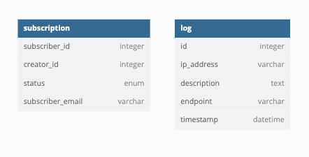

# Cooklyst - SOAP Service

> Tugas Milestone 2 IF3110 Web-based Application Development - SOAP Web Service Using JAX-WS

## Deskripsi Web Service

Sebuah web service yang dibangun dengan tech stack JAX-WS. Web service ini menyediakan layanan untuk melihat dan mengatur subscription untuk pro version pada aplikasi Cooklyst.

## Skema Basis Data

## Cara Instalasi

1. [Install Docker](https://docs.docker.com/engine/install/)

## Cara Menjalankan

1. Ikuti cara menjalankan di repository `tubes-2-wbd-docker`.

## Payload dan Response API

[Dokumentasi Postman](https://documenter.getpostman.com/view/28065465/2s9YXpUyWU)

## Pembagian Tugas

| Task         | NIM                |
| ------------ | ------------------ |
| Setup        | 13521121, 13521129 |
| Subscription | 13521091, 13521129 |
| Logger       | 13521121           |
| Email        | 13521091, 13521129 |

## Author

- 13521091 Fakih Anugerah Pratama
- 13521121 Saddam Annais Shaquille
- 13521129 Chiquita Ahsanunnisa
